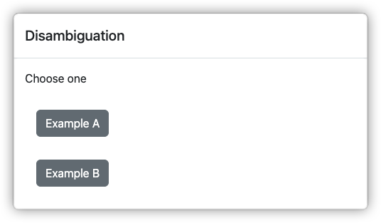
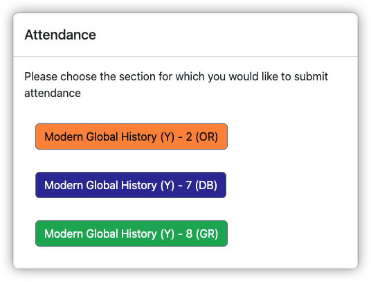

# Redirect

Redirect paths to another domain running as a service on Google Cloud Run

## Install

If you have not already verified ownership of the domain in [Google Search Console](https://search.google.com/search-console/), you will need to add it as a property there first and verify ownership.

Clone the repo, install dependencies, deploy to Google Cloud Run.

```bash
git clone git@github.com:groton-school/redirect.git path/to/repo
cd path/to/repo
pnpm install
pnpm run deploy
```

Once deployed to Google Cloud Run, visit the [Cloud Run Domain Mappings](https://console.cloud.google.com/run/domains) and add a mapping to the desired domain. It will take 30-60 minutes for the domain to map and SSL cert to be issued.

## Usage

Out of the box, all redirects are pointed to our Veracross Portals host. The PHP script is simply replacing `https://portals.groton.org` with `https://portals.veracross.com/groton` in its redirect. Edit [app/index.php](./app/index.php) and re-deploy (`pnpm run deploy`) to adjust your redirect.

In order to present portal URLs within the `groton.org` domain consistently a `veracross.com` URL such as:

```
https://portals.veracross.com/groton/facstaff/calendar/faculty
```

can be distributed as:

```
https://portals.groton.org/facstaff/calendar/faculty
```

### Path Variables

If a URL path includes a variable and the query contains potential values for that variable, a disambiguation page is shown:

```
https://portals.groton.org/path/with/:var/in/it?var[]=Example+A&var[]=Example+B
```



The disambiguator supports the following query parameters:

| Name | Type | Purpose |
| --- | --- | --- |
| `var` | `string[]` | Values to replace `:var` in the path provided (only the first `:var` in the path will be processed) |
| `caption` | `string[]` | Optional captions (in the same order as `var`) provided to the user (default: present the `var` values) |
| `title` | `string` | Title of both the page and the dialog (Default: `"Disambiguation"`) |
| `instructions` | `string` | Custom instructions to present to the user above the choices (default: `"Choose one"`) |
| `target` | `string` | HREF target value for the provided links (e.g. `"_top"` or `"_blank"`, default: none) |

These can be used to provide a clearer user interface:

```
https://portals.groton.org/facstaff/class/:id/attendance?id[]=123&caption[]=Modern%20Global%20History%20(Y)%20-%202%20(OR)&id[]=456&caption[]=Modern%20Global%20History%20(Y)%20-%207%20(DB)&id[]=789&caption[]=Modern%20Global%20History%20(Y)%20-%208%20(GR)&title=Attendance&instructions=Please%20choose%20the%20section%20for%20which%20you%20would%20like%20to%20submit%20attendance&target=_top
```

Link captions that include Groton-standard color blocks will be color-coded:

